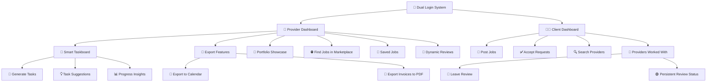

# 🧰 Service Suite

> A unified productivity platform designed for student entrepreneurs and solo creators.

---

## 🧠 Project Description

We have seen that it was very difficult for most students to find work, get an internship or apply their skills and another gap where people where struggling to find quality skills to get their work done so we built Service Suite as a local app where it is something where the students and our college crowd can help each other out. For example: the tennis team want a photoshoot and are looking for a good photographer or let's say a photographer needs a personal website portfolio built for them now usually we just have to find someone through mutuals with no guarantee of skill. Thats where Service Suite comes in, you can post a job and everyone on the platform can apply, where the resumes can be viewed along with the applicant's previous work's reviews and ratings as well and we can also auto generate a resume based on all their details if they don't have one in place. along with a lot of task management for the service providers. This has an element of trust which other platforms with random freelancers don't and is usually at a much better pricing with great understanding between both parties since they're in the same community.

---

## 💡 Key Highlights

- **🎯 Dual-role Dashboards**  
  Tailored dashboards for **Providers** and **Clients**, giving each role the tools they need without extra noise.

- **🧠 Smart AI Taskboard**  
  Auto-generates tasks from plain input, provides suggestions, and gives progress insights.

- **🤝 Streamlined Job Collaboration**  
  Post jobs, accept proposals, manage reviews, and communicate — all in one place.

- **💼 Portfolio & Reviews**  
  Providers can build detailed portfolios with real-time average ratings, review cards, and context.

- **📅 Export Options**  
  Export to-dos to calendar apps, download PDF invoices, and more.

- **🌐 Built-in Marketplace**  
  Browse, bookmark, and apply to job opportunities without leaving the suite.

- **🔖 Saved Jobs & Bookmarks**  
  Quick access to favorite listings for future use.

- **🧾 Transparent Reviews**  
  Once a job is reviewed, it’s always marked accordingly — building trust and accountability.

---

## 🚀 Features & Innovations

- **AI Schedule Optimizer** – Weekly plan generator and smart to-do assistance.
- **Smart Task Estimator** – Time predictions and urgency cues.
- **Client Request Analyzer** – Categorizes and interprets job posts.
- **Productivity Insights** – AI suggestions to improve workflow.
- **Real-time Reviews** – Integrated with portfolios.
- **Saved Bookmarks** – Revisit and act on important job posts.
- **Persistent Statuses** – Reviewed = Reviewed. Always.
- **Sleek UI** – Gradient badges, responsive layouts, and clean typography.

---

## 🛠 Tech Stack

**Frontend**

- React (TypeScript)
- Next.js (App Router)
- Tailwind CSS
- ShadCN UI

**Backend**

- Supabase (Auth, DB, API, Storage)
- PostgreSQL (via Supabase)

**AI**

- OPENAI APIs (for task & text intelligence)

---

## ⚙️ Setup Instructions

1. **Clone the repository**

   ```bash
   git clone https://github.com/HackSomeThorns-2025/Dreadful_APIs.git
   cd Dreadful_APIs
   ```

2. **Install project dependencies**

   ```bash
   npm install
   ```

   <!-- #kohli@0511 -->

3. **Set environment variables**

   Create `.env.local` and add:

   ```
   NEXT_PUBLIC_SUPABASE_URL=your_supabase_url
   NEXT_PUBLIC_SUPABASE_ANON_KEY=your_supabase_anon_key
   OPENAI_API_KEY=your_openai_key
   MODEL_PROVIDER=openai # or gemini, groq, etc.
   ```

4. **Run locally**

   ```bash
   npm run dev
   ```

---

## 📦 Dependencies

- react, next.js, typescript, tailwindcss
- @shadcn/ui
- @supabase/supabase-js
- lucide-react
- dotenv
- openai AI

---

## 👥 Team Details

**Team:** Dreadful APIs  
_Just two students building something useful._

| Name                 | Department       | Reg. No.  |
| -------------------- | ---------------- | --------- |
| Kashyap Datta Dhondu | Computer Science | 230905392 |
| Manas Goel           | Data Science     | 230968160 |

---

## 🔁 Workflow Overview



---

## 🔗 Useful Links

- [Supabase](https://supabase.com)
- [Next.js](https://nextjs.org)
- [Tailwind CSS](https://tailwindcss.com)
- [OPENAI API](https://platform.openai.com/api-keys)
- [ShadCN UI](https://ui.shadcn.com)

---

_This README will evolve as the product does. Contributions and stars appreciated!_
